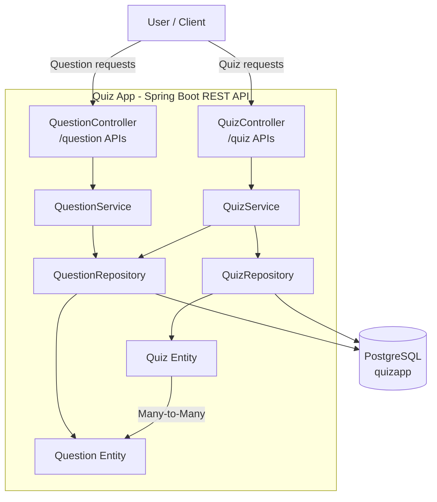

# Quiz App Design

```mermaid
flowchart TD
    User["User / Client"]

    subgraph App["Quiz App - Spring Boot REST API"]
        QC["QuestionController<br/>/question APIs"]
        ZC["QuizController<br/>/quiz APIs"]

        QS["QuestionService"]
        ZS["QuizService"]

        QR["QuestionRepository"]
        ZR["QuizRepository"]

        QE["Question Entity"]
        ZE["Quiz Entity"]
    end

    DB[("PostgreSQL<br/>quizapp")]

    User -->|"Question requests"| QC
    User -->|"Quiz requests"| ZC

    QC --> QS
    ZC --> ZS

    QS --> QR
    ZS --> QR
    ZS --> ZR

    QR --> QE
    ZR --> ZE

    QR --> DB
    ZR --> DB

    ZE -->|"Many-to-Many"| QE
```